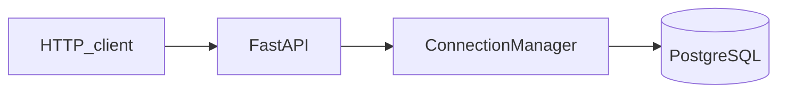
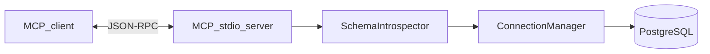
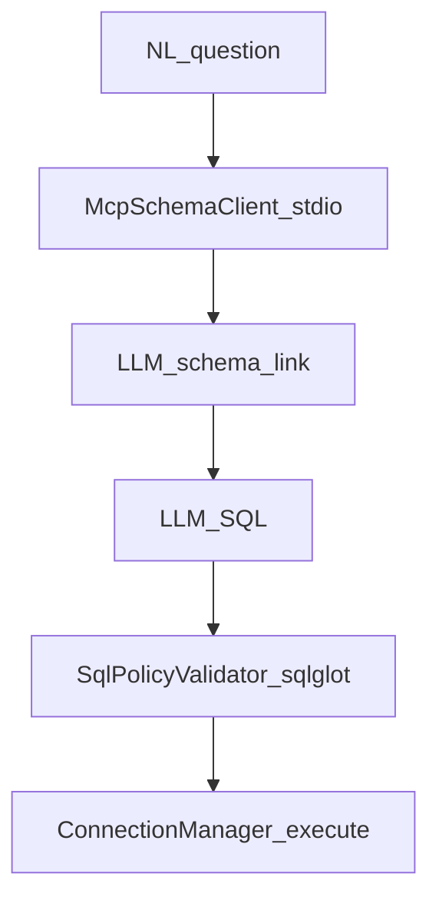

# QueryMind architecture (Phases 0–4)

## Components

| Component | Role |
|-----------|------|
| `backend` | FastAPI HTTP API: health, readiness, demo query, optional gated ad-hoc read SQL, **NL→SQL agent** |
| `backend/agent` | `QueryMindAgent`: Groq (LangChain), MCP schema client, **sqlglot** `SqlPolicyValidator`, retries |
| `database` | `ConnectionManager`, `SchemaIntrospector`, **`SchemaCatalog`** (allowlists from MCP summary) |
| `mcp_server` | Separate **stdio** MCP process exposing read-only **schema** tools; **`McpSchemaClient`** spawns it from the API |
| `frontend` | Streamlit UI — HTTP to FastAPI only |
| `core` | `Settings` (pydantic-settings), logging setup, shared exceptions |

## Request flow (HTTP)

## MCP flow (stdio)

## Agent flow (Phase 3)

## Trust boundaries

1. **HTTP API** never accepts arbitrary SQL unless `ALLOW_ADHOC_SQL=true` (intended for local development only).
2. **MCP tools** only run **predetermined introspection SQL** and validate dynamic identifiers (`schema_name`, `table_name`) with a strict pattern.
3. **Agent-generated SQL** is checked by **sqlglot** against a **SchemaCatalog** built from MCP (allowlisted tables/columns) before execution.
4. **PostgreSQL** should still use a **read-only** role; application checks are defense in depth, not the primary control.
5. **Streamlit** has no database credentials; it only calls the REST API.

## Configuration

All credentials and URLs are read from the environment (see [.env.example](../.env.example)). `DATABASE_URL` is required for both the API and the MCP server.

## Error model

Domain errors inherit `QueryMindError` and are mapped to HTTP JSON responses (`error.code`, `error.message`, `error.details`) by FastAPI exception handlers in `backend/main.py`.
